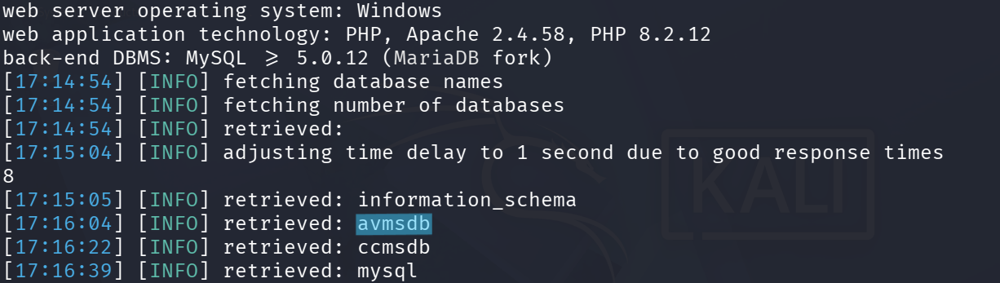

# CVE-2026-39109 – SQL Injection (SQLi)

## 📌 Description
A SQL Injection vulnerability in the **Apartment Visitors Management System V1.1** allows an unauthenticated attacker to manipulate backend SQL queries via the `username` parameter on the login page (`index.php`). By providing crafted SQL input, an attacker can bypass the authentication mechanism, gain unauthorized access to the administrative dashboard, and extract sensitive information from the backend database.

## 🧱 Affected Product
- **Product:** Apartment Visitors Management System
- **Vendor:** PHPGurukul
- **Version:** V1.1

## 📂 Affected Component
- **File:** `index.php` (Login Page)
- **Parameter:** `username`
- **Request Method:** POST
- **Module:** Authentication Module

## 🎯 Attack Vector
An unauthenticated remote attacker can exploit this vulnerability by submitting a malicious SQL payload through the `username` field. Since the application fails to use prepared statements or adequate input filtering, the payload is executed directly by the database engine.

## 🔍 Vulnerability Type
SQL Injection (In-Band / Boolean-Based)

## ⚠️ Impact
- **Authentication Bypass:** Unauthorized access to the admin panel.
- **Information Disclosure:** Access to sensitive data such as admin credentials, visitor logs, and resident details.
- **Data Integrity:** Potential to modify or delete database records.
- **Full Database Extraction:** Ability to dump the entire database schema and content.

## 🧪 Proof of Concept
The vulnerability was validated by intercepting the login request and injecting a SQL payload. A simple `' OR 1=1-- -` payload in the `username` parameter allows access without a valid password. 

Advanced extraction was also confirmed using automated tools to map the database structure and retrieve table contents.



### Request Flow
The vulnerability occurs during the processing of the POST request sent to `index.php`. The application concatenates the user-supplied `username` string directly into the SQL query:

```sql
SELECT * FROM tbladmin WHERE AdminUserName = '$username' AND Password = '$password'
```

By injecting ' OR 1=1 -- -, the attacker changes the query logic to always return true, effectively logging them in as the first user in the table (typically the admin).

 ## 🛡 Mitigation
 - Use Prepared Statements: Implement PDO or MySQLi with parameterized queries to separate SQL logic from data.
 - Input Validation: Restrict the username field to specific character sets and lengths.
 - Principle of Least Privilege: Ensure the database user account has the minimum necessary permissions.

 ## 🔗 References
 - https://phpgurukul.com/apartment-visitors-management-system-using-php-and-mysql/
 - https://phpgurukul.com/?sdm_process_download=1&download_id=21524

 ## 👤 Discoverer
KAAN EFE
