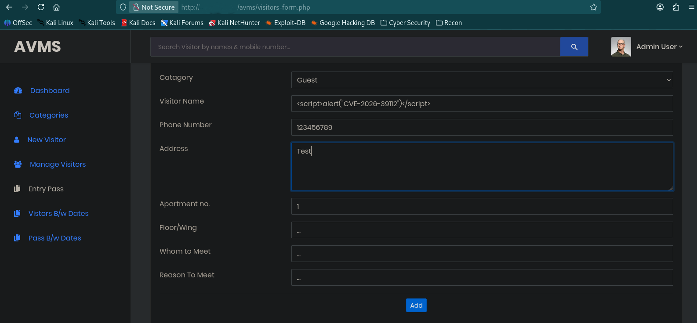
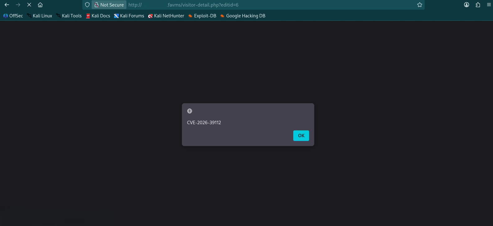

# CVE-2026-39112 – Stored Cross-Site Scripting (XSS)

## 📌 Description
A Stored Cross-Site Scripting (XSS) vulnerability in the **Apartment Visitors Management System V1.1** allows an authenticated attacker to inject arbitrary JavaScript code via the `visname` parameter in `visitors-form.php`. This malicious script is permanently stored in the backend database and executed in the browser of any administrative user who views the visitor logs.

## 🧱 Affected Product
- **Product:** Apartment Visitors Management System
- **Vendor:** PHPGurukul
- **Version:** V1.1

## 📂 Affected Component
- **File:** `visitors-form.php`
- **Parameter:** `visname` (Visitor Name)
- **Request Method:** POST
- **Module:** Visitor Management Module

## 🎯 Attack Vector
An authenticated attacker can exploit this by submitting a JavaScript payload through the "Visitor Name" field. The payload is later rendered without proper output encoding on the `manage-newvisitors.php` and `visitor-detail.php` pages.

## 🔍 Vulnerability Type
Stored Cross-Site Scripting (XSS)

## ⚠️ Impact
- **Session Hijacking:** Potential theft of administrative session cookies.
- **Unauthorized Actions:** Execution of administrative tasks in the context of the victim.
- **Privilege Escalation:** Gaining higher-level access through the victim's browser session.

## 🧪 Proof of Concept
The vulnerability was confirmed by submitting a JavaScript payload (e.g., ``) through the `visname` parameter. The payload was stored and executed when an administrator accessed the visitor management panel.

--------------------------------------------

### Request Flow
1. Attacker submits a POST request to `visitors-form.php` with a malicious `visname`.
2. The application saves the raw script into the database.
3. Administrator visits `manage-newvisitors.php`.
4. The server reflects the script into the HTML body, and the victim's browser executes it.

## 🛡 Mitigation
- **Output Encoding:** Use `htmlspecialchars()` to encode all user-supplied data before rendering it in HTML.
- **Input Sanitization:** Sanitize input to remove or neutralize potentially dangerous tags like `<script>`.
- **Content Security Policy (CSP):** Implement a CSP to block the execution of unauthorized inline scripts.

## 🔗 References
- https://phpgurukul.com/apartment-visitors-management-system-using-php-and-mysql/
- https://phpgurukul.com/?sdm_process_download=1&download_id=21524

## 👤 Discoverer
Efe Kaan AKKAR
